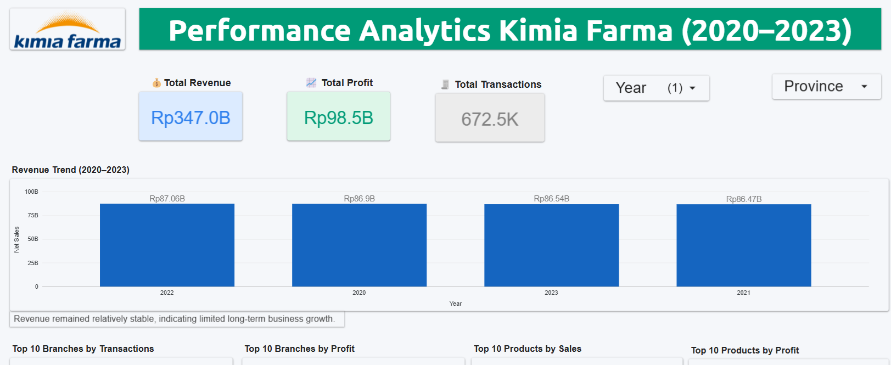

# Kimia Farma Business Performance Analysis

Business performance analysis project using BigQuery and Looker Studio for evaluating Kimia Farma sales performance from 2020–2023.

---

## Project Overview

This project aims to analyze Kimia Farma business performance based on transaction, branch, and product data.

The analysis focuses on:
- Revenue trend
- Profit performance
- Top-performing branches
- Top-performing products
- Regional sales distribution
- Business insights and recommendations

---

## Tools Used

- Google BigQuery
- Looker Studio
- SQL
- GitHub

---

## Dataset

The datasets used in this project:
- kf_final_transaction
- kf_inventory
- kf_kantor_cabang
- kf_product

---

## SQL Analysis

The analysis table was created using BigQuery SQL by joining transaction, branch, inventory, and product tables.

Main calculations:
- Nett Sales
- Nett Profit
- Gross Profit Percentage

SQL query:
- `kf_analysis_query.sql`

---

## Dashboard Preview

---

## Key Insights

- Revenue remained relatively stable around Rp86–87B annually without significant growth.
- Sales and profits were concentrated in several branches, especially in Java region.
- Psycholeptics category contributed significantly to both revenue and profit.
- Several branch types dominated transaction activities, especially Apotek and Klinik & Apotek.

---

## Recommendations

- Increase product diversification to reduce dependency on specific categories.
- Improve expansion strategy in lower-performing regions.
- Optimize high-performing branches as operational benchmarks.

---

## Interactive Dashboard

(Add Looker Studio link here later)
